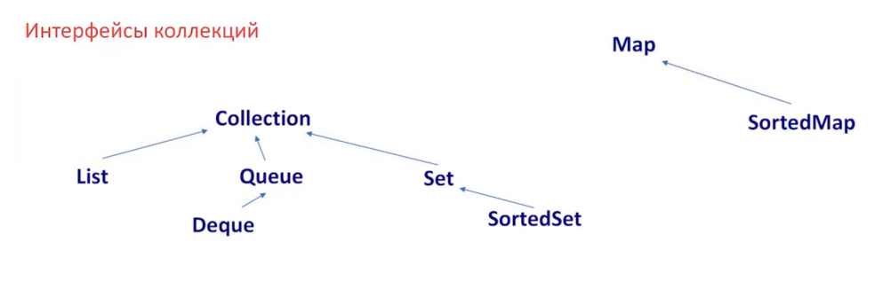

# 🧩 Лекция 3 — Структуры данных в Java

---

## 🎯 Основные темы

- Полная структура коллекций Java: иерархия интерфейсов, основные реализации, сложность операций, когда что использовать.

## 🗺️ Иерархия интерфейсов и основные реализации

package java.util;

Collection.java

public interface Collection<E> extends Iterable<E>

{ width=80% }

### `Iterable` → `Collection<E>`

- `List<E>`
    - `ArrayList`
    - `LinkedList`
- `Set<E>`
    - `HashSet`
    - `LinkedHashSet`
    - `SortedSet<E>`
        - `TreeSet`
- `Queue<E>`
    - `PriorityQueue`
    - `Deque<E>`
        - `ArrayDeque`

> ❗ `Map<K,V>` **не наследуется** от `Collection`, но входит в Collections Framework.

### `Map<K,V>`

- `SortedMap<K,V>`
    - `TreeMap`
- `HashMap`
- `ConcurrentMap<K,V>`
    - `ConcurrentHashMap`

## 📦 ArrayList — массив с динамическим ростом

class ArrayList<E> {
    transient Object[] elementData; // массив элементов
    private int size;              // текущее количество элементов
}

При создании List<String> list = new ArrayList<>(); — создается массив длины 0 (lazy init).
При первом добавлении — выделяется массив размером 10.
При переполнении — новый размер:
newCapacity = oldCapacity + (oldCapacity >> 1) → +50% (не 2x!)
✅ Почему 1.5x, а не 2x? — Экономия памяти + баланс между частотой копирования и фрагментацией.

Capacity не уменьшается автоматически → используй trimToSize() для экономии.

## ⏱️ Алгоритмическая сложность ArrayList

list.get(i); // O(1) Прямой доступ по индексу
list.add(value); // O(1)* - амортизированная, O(n) - худшая при ресайзе
list.add(i, value); // O(n) Сдвиг всех элементов справа
list.remove(i); // O(n) Сдвиг всех элементов слева
list.contains(v); // O(n) Линейный поиск
iterator().next(); // O(1) Быстрый обход

## 🔗 LinkedList — двусвязный список

Двусвязный список. Прыгает по памяти, поэтому работает медленно.

Внутреннее устройство:
class Node<E> {
    E item;
    Node<E> next;
    Node<E> prev
}

Каждый элемент — отдельный объект в куче → прыжки по памяти → плохая локальность → медленнее, чем ArrayList в большинстве случаев.
Добавление/удаление в начале/конце — O(1)
Доступ по индексу — O(n)

🧠 Цитата от Joshua Bloch (создатель LinkedList):
“Does anyone actually use LinkedList? I wrote it, and I never use it.”

Когда использовать?
✅ Только если ты очень часто вставляешь/удаляешь в начале или середине списка, и не нужен доступ по индексу.
❌ В 95% случаев — ArrayList будет быстрее и эффективнее.

## 🚦 Queue / Deque — интерфейсы для очередей

ArrayDeque — циклический буфер (ring buffer).
 - Все операции в начале/конце — O(1)
 - Реализует Deque → можно использовать как стек или очередь.
 - Внутри — массив, растёт по формуле: newSize = 2 * oldSize + 2
 - Не потокобезопасен

✅ Лучший выбор для стека/очереди в однопоточном коде → быстрее LinkedList.

## 🗃️ HashMap — хеш-таблица

Внутреннее устройство:

class HashMap<K,V> {
    Node<K,V>[] table; // массив "корзин"
    int size;          // количество элементов
}

static class Node<K,V> implements Map.Entry<K,V> {
    final int hash;
    final K key;
    V value;
    Node<K,V> next;    // следующий узел в цепочке
}

 - Используется цепочечная адресация.
 - Изначально table = null → создаётся при первом put() → размер 16.
 - Load factor = 0.75 → при достижении 12 элементов → ресайз до 32.
 - Ресайз → в 2 раза.
 - Коллизии → цепочки (linked list) → с Java 8, если >8 элементов → красно-чёрное дерево.
✅ hashCode() → определяет корзину
✅ equals() → проверяет, тот ли ключ

## 🌲 TreeMap — отсортированная мапа

 - Основана на красно-чёрном дереве → сбалансированное BST.
 - Все операции — O(log n)
 - Ключи должны реализовывать Comparable или передаваться Comparator
 - Итерация — в отсортированном порядке

 - ✅ Используй, если нужна сортировка по ключам или range-запросы (subMap, headMap, tailMap)

## 🧩 HashSet, TreeSet, LinkedHashMap — обёртки

### HashSet

 - Внутри использует HashMap<E, Object> → значения — заглушки (PRESENT).
 - Сложность операций — как у HashMap: O(1)

### TreeSet

 - Внутри использует TreeMap<E, Object>
 - Сложность — O(log n)

### LinkedHashMap

 - Наследуется от HashMap
 - Добавляет двойной связанный список для сохранения порядка вставки (или доступа)
 - Итерация — в порядке вставки (или LRU, если accessOrder=true)
 - Небольшой overhead на поддержание списка при добавлении → остальные операции — как у HashMap
 - ✅ Отлично подходит для LRU-кэшей → переопредели removeEldestEntry()

## 💡 Практические советы на собеседовании

Почему ArrayList чаще LinkedList?  
→ Локальность данных, меньше аллокаций, быстрее в реальных сценариях.  

Что будет, если не переопределить hashCode() и equals() для ключа в HashMap?  
→ Объекты не будут находиться → нарушение контракта.  

Как работает ConcurrentHashMap?  
→ Разделён на сегменты (до Java 8) → с Java 8 — использует CAS + synchronized на уровне корзины → высокая конкурентность.  
Fail-Fast vs Fail-Safe?  
→ ArrayList.iterator() — fail-fast → ConcurrentModificationException  
→ ConcurrentHashMap.keySet().iterator() — fail-safe → работает с копией  

Как уменьшить capacity ArrayList?  
→ trimToSize()  

## 📚 Рекомендуем к прочтению

📖 Effective Java — Joshua Bloch (главы 3, 6 — коллекции и equals/hashCode)

📖 Java Concurrency in Practice — Brian Goetz (глава 5 — коллекции в многопоточке)

🌐 [Oracle Java Collections Tutorial](https://docs.oracle.com/javase/tutorial/collections/?spm=a2ty_o01.29997173.0.0.1b35c921FmKv3G)
